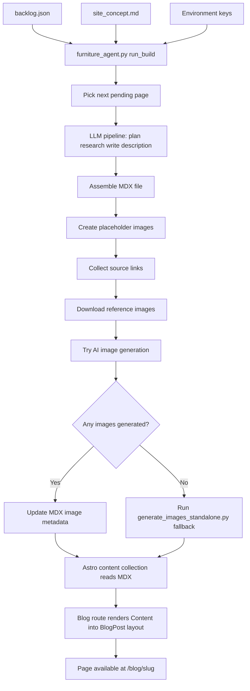
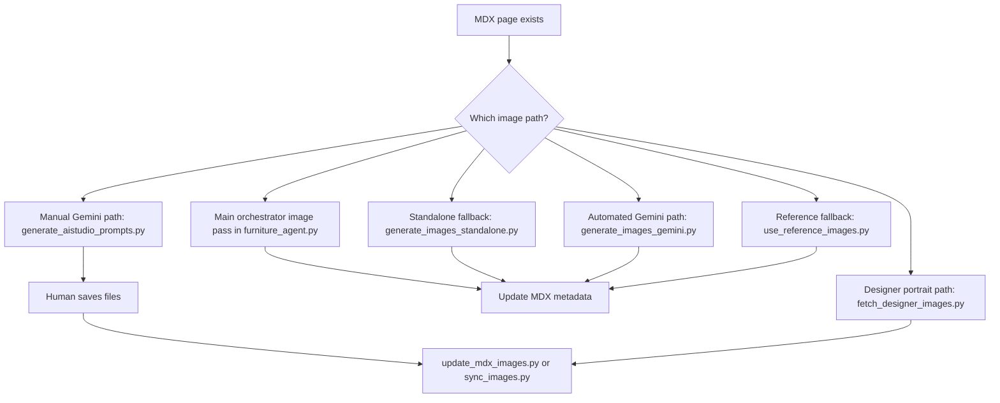

# Blog Page Creation Architecture

This document explains, in plain English, how this site creates a new blog page, what parts are automated, where the workflow branches, and which files control each step.

It is written for architecture review. The goal is not just to explain what happens, but to make it easier to discuss:

- where the current pipeline is strong
- where it is fragile
- where new branches or replacement steps could be added

## One-Sentence Summary

The site creates a page by using a Python orchestrator to pick one chair from the backlog, generate an article and frontmatter, optionally discover and collect reference images, optionally generate production images, and then hand the resulting MDX file to Astro, which renders it through the blog content collection, route, layout, and image components.

## The Main Moving Parts

There are four major layers in the system:

1. Planning and content generation
   - Main script: `furniture_agent.py`
   - Inputs: `backlog.json`, `site_concept.md`, environment variables
   - Output: `src/content/blog/<slug>.mdx`

2. Image discovery, prompts, and generation
   - Main scripts: `furniture_agent.py`, `generate_images_standalone.py`, `generate_images_gemini.py`, `generate_aistudio_prompts.py`, `fetch_designer_images.py`, `use_reference_images.py`
   - Outputs: files under `public/images/`, `public/images/reference/`, `public/images/generated/`, and `public/images/generated-prompts/`

3. Metadata synchronization and content wiring
   - Main scripts: `update_mdx_images.py`, `sync_images.py`, `insert_image_slots.py`, `migrate_to_registry.py`, `audit_image_registry.py`
   - Purpose: keep the MDX frontmatter and inline image usage aligned with the files on disk

4. Site rendering
   - Astro collection schema: `src/content.config.ts`
   - Blog route: `src/pages/blog/[...slug].astro`
   - Layout: `src/layouts/BlogPost.astro`
   - Inline image component: `src/components/ImageWithMeta.astro`

## End-to-End Flow

## Step-by-Step Explanation

### 1. The system chooses one page to build

The entry point is `furniture_agent.py`.

The `run_build()` function does this:

- validates the environment
- loads `backlog.json`
- initializes the backlog from the built-in default list if needed
- picks the first pending slug that does not already exist in `src/content/blog/`

Key functions:

- `load_backlog()`
- `init_backlog()`
- `pick_next_page()`
- `mark_done()`

Important architecture detail:

- this system is intentionally single-item, not batch-oriented
- one run is supposed to build one page and stop

This makes review safer, but it also means the architecture is optimized for manual review cadence, not throughput.

### 2. The article is generated in four LLM stages

After a page is selected, `run_pipeline()` in `furniture_agent.py` creates the editorial content in four stages:

1. `plan`
   - creates an editorial brief
2. `research`
   - creates a structured research brief
3. `article_body`
   - writes the actual article body in Markdown
4. `description`
   - creates the meta description

These stages use checkpoints in `.checkpoints/<slug>/` so a failed run can resume instead of starting over.

Key functions:

- `run_pipeline()`
- `_save_checkpoint()`
- `load_checkpoint()`
- `clear_checkpoints()`
- `_validate_article_body()`
- `_post_process_article()`

Important architecture detail:

- the article body is generated before Astro sees anything
- Astro is not involved in the writing process
- Astro only renders the finished MDX content after Python has written it to disk

### 3. The MDX file is assembled with frontmatter and inline image placeholders

Once the text exists, `_assemble_from_checkpoints()` writes the final file to `src/content/blog/<slug>.mdx`.

This step does three important things:

- builds YAML frontmatter using `_build_frontmatter()`
- injects the `ImageWithMeta` import
- converts image markers into `ImageWithMeta` component calls in the article body

The initial frontmatter is deliberately provisional. It includes:

- title
- description
- publication date
- hero image metadata
- an `images` array for body images
- designer / era / category

At this stage, image metadata usually starts in a placeholder or pending state.

Important architecture detail:

- the MDX file is the main handoff artifact between the automation layer and the site layer
- if you want to redesign the system, this file is the clearest seam in the architecture

### 4. Placeholder images are created so the page can exist even if image generation fails

Still inside `furniture_agent.py`, the orchestrator creates placeholder images with:

- `ensure_placeholder_hero()`
- `ensure_placeholder_images()`

That means the page can be created even when:

- no image provider is configured
- prompt files are missing
- reference collection fails
- generation fails

This is a deliberate non-blocking design choice.

Architecture consequence:

- the page pipeline is resilient
- but it also allows incomplete pages to look “finished enough” unless provenance and metadata are reviewed carefully

### 5. Source links are discovered for later image use

After the article exists, `collect_image_sources()` uses Tavily search to build `public/images/generated-prompts/<slug>/image-sources.txt`.

This file is not the final display metadata. It is a working source bank for:

- research
- reference collection
- later prompt and image work

Important distinction:

- source discovery is broad and permissive
- publication metadata in the MDX frontmatter is narrower and must match the actual selected image

This distinction also appears in `docs/automation-requirements.md` as the “reference bank vs display fallback” rule.

### 6. Reference images are harvested and stored locally

If source discovery succeeds, `collect_reference_images()` downloads a limited set of candidate images into:

- `public/images/reference/<slug>-reference/`

It also writes:

- `reference-metadata.json`

This metadata records things like:

- source page
- download URL
- local file path
- license placeholder
- origin placeholder
- download status

Purpose of this layer:

- it gives the system real chair images for visual guidance
- it also provides a fallback bank if AI generation is unavailable or poor

### 7. The main orchestrator tries to generate production images

The next step is `generate_and_log_images()` in `furniture_agent.py`.

It attempts to generate image slots from prompt files stored in:

- `public/images/generated-prompts/<slug>/`

It reads prompt files using `_read_prompt_bundle()` and writes provenance to:

- `public/images/generated-prompts/<slug>/provenance-generated.json`

If generation succeeds, `_apply_generated_image_metadata()` updates the MDX frontmatter so the image records move from placeholder/pending to actual/original.

Important architecture detail:

- the main orchestrator currently reads prompt files during generation
- but `run_build()` does not currently generate those prompt files in the same code path
- there is a `save_image_prompts()` helper in `furniture_agent.py`, but it is not called by `run_build()`

This means the current architecture has an implicit dependency:

- prompt files must already exist, or
- the fallback path must create them later

That is one of the most important discussion points in the current architecture.

### 8. If the main image phase generates nothing, a fallback script runs

If `generate_and_log_images()` produces no images, `run_build()` launches:

- `generate_images_standalone.py <slug>`

This fallback script has two stages:

1. `generate_prompts_with_ai()`
   - reads the article content and backlog metadata
   - uses an LLM to create prompt text
   - saves prompt files into `public/images/generated-prompts/<slug>/`

2. `generate_images()`
   - calls back into `furniture_agent.generate_and_log_images()`

In other words, the fallback closes a gap in the main flow:

- the fallback can create prompt files that the main flow expected to already exist

This works, but architecturally it is indirect.

A simpler future design might make prompt generation an explicit step inside `run_build()` instead of a separate recovery branch.

## Image Branches

The site does not have one single image workflow. It has several branches.

### Branch A: Main orchestrator image pass

This is the default branch during `furniture_agent.py` execution.

Strengths:

- integrated with page creation
- writes provenance
- updates MDX metadata automatically when successful

Weaknesses:

- depends on prompt files already being present
- only covers the slots known to `IMAGE_SLOT_PROMPT_FILES`

### Branch B: Standalone prompt-and-image recovery

`generate_images_standalone.py` is effectively a repair branch for pages that already exist.

Use it when:

- the article exists
- the main run did not produce prompts or images
- you want the script to infer prompts from the article and try again

### Branch C: Automated Gemini generation

`generate_images_gemini.py` is the separate automated API-based image pipeline.

It can:

- read prompt files
- load references from `reference-metadata.json`
- generate selected slots
- archive outputs using `image_archive.py`
- update MDX metadata in the same run

This is a more explicit image workflow than the one embedded in `furniture_agent.py`.

### Branch D: Manual AI Studio workflow

`generate_aistudio_prompts.py` prepares a batch file for human-in-the-loop generation.

This branch is useful when:

- the API path is unreliable
- you want to inspect prompts manually
- you want to attach references by hand in Google AI Studio

After saving the images manually, the metadata path rejoins through:

- `update_mdx_images.py`
- or `sync_images.py`

### Branch E: Reference-image fallback

`use_reference_images.py` is the non-AI fallback.

It copies downloaded reference images into display slots and updates frontmatter to say the page is using archival/reference material rather than AI output.

This is important because it keeps the publishing pipeline moving even when generation is unavailable.

### Branch F: Designer portrait workflow

Designer images follow a different logic from chair images.

The documented designer path is in:

- `docs/designer-images-workflow.md`
- `fetch_designer_images.py`

The intended order is:

1. try to find a real portrait photo
2. use Wikimedia / Wikidata sources where possible
3. only fall back to AI portrait generation if needed

That is architecturally different from the chair-image workflow, which is more willing to use AI guided by references.

## How the Page Reaches the Site

Once the MDX file exists, Astro takes over.

### 1. The content schema validates the file

`src/content.config.ts` defines the `blog` collection schema.

This is where the site defines what a valid article must contain.

Important fields include:

- `title`
- `description`
- `pubDate`
- `heroImage*`
- `images[]`
- `designer*`
- `era`
- `category`

Architecture consequence:

- if the automation writes invalid frontmatter, the page may fail to build
- this schema is the contract between Python output and Astro rendering

### 2. The blog route loads and renders the entry

`src/pages/blog/[...slug].astro` does three jobs:

- loads all blog collection entries
- creates static paths
- renders the MDX content into the blog layout

It also passes image registry data into MDX content through:

- `entryImages={post.data.images ?? []}`

That is what allows `ImageWithMeta` components in the MDX body to resolve image metadata from frontmatter.

### 3. The blog layout renders the page shell

`src/layouts/BlogPost.astro` renders:

- the title
- hero image and hero metadata
- sidebar metadata
- designer section
- structured data
- previous/next navigation
- related-by-designer links

This file controls how the generated content appears to the reader.

### 4. The image component resolves image records

`src/components/ImageWithMeta.astro` resolves image metadata in two ways:

- registry-first via `id` plus `images` / `entryImages`
- inline fallback via direct props

Current preferred pattern:

- use `id="<slug>-<slot>"`
- let the component look up metadata in the frontmatter registry

This is important because it keeps one source of truth for image metadata.

## The Metadata Repair Layer

Several scripts exist because the page pipeline is not a single perfect pass. In practice, files and metadata can drift apart.

### `update_mdx_images.py`

Use when:

- images were created manually
- only the file extension or slot paths need updating

### `sync_images.py`

Use when:

- images exist on disk
- frontmatter is missing or incomplete
- you may also want to insert image slots into the article body

### `insert_image_slots.py`

Use when:

- the frontmatter `images[]` registry is correct
- but the article body is missing `ImageWithMeta` references

### `migrate_to_registry.py`

Use when:

- older articles still have inline image props in MDX
- you want to normalize them into the frontmatter registry model

### `audit_image_registry.py`

Use when:

- you want a quality check across all image metadata
- you want to catch “TBD”, missing sources, stale inline props, or missing files

Architecturally, this repair layer exists because the system is modular and tolerant of partial success. That improves resilience, but it also increases the need for explicit validation.

## Data and Artifact Map

These are the key artifacts in the system and what they mean.

### Planning and article artifacts

- `backlog.json`
  - queue of pages to build
- `site_concept.md`
  - editorial rules and tone source
- `.checkpoints/<slug>/`
  - resumable LLM outputs during generation
- `src/content/blog/<slug>.mdx`
  - the canonical article artifact for the site

### Image working artifacts

- `public/images/generated-prompts/<slug>/`
  - prompt bundle, source bank, provenance
- `public/images/reference/<slug>-reference/`
  - downloaded references plus `reference-metadata.json`
- `public/images/generated/<slug>/timestamp/`
  - archived generated images and metadata
- `public/images/<slug>-<slot>.<ext>`
  - the deployed display image files used by the site

## Where the Architecture Is Strong

- The MDX file is a clean boundary between content automation and site rendering.
- The pipeline is resilient because image failures do not block article creation.
- The image metadata model in `src/content.config.ts` is explicit enough to support provenance, review, and future QA tooling.
- The Astro rendering layer is well separated from the Python generation layer.
- The repair scripts make it practical to recover from partial runs instead of starting over.

## Where the Architecture Is Fragile

### Prompt generation is not explicit in the main build path

The biggest current weakness is that `run_build()` attempts image generation by reading prompt files, but it does not clearly generate those prompt files as a required prior step.

Current consequence:

- the pipeline may depend on old prompt artifacts
- or it may depend on the fallback script to create prompts later

This is workable, but it is indirect and hard to reason about.

### README-level workflow and code-level workflow have drifted apart

The README still describes a simpler single pipeline story. The actual codebase now behaves more like a hub with several branches:

- main orchestrator branch
- standalone fallback branch
- Gemini API branch
- AI Studio manual branch
- reference fallback branch
- designer portrait branch

That is not necessarily bad, but it should be documented as the real architecture.

### Multiple image slot vocabularies exist

Different scripts use overlapping but not identical slot sets, for example:

- `hero`
- `context`
- `silhouette`
- `sketch`
- `detail-material`
- `detail-structure`
- `designer`

This is manageable, but it increases the chances of mismatch between:

- prompt files
- frontmatter IDs
- actual image files
- body components

### The system is resilient by allowing partial completion, but that moves complexity into QA

Because the pipeline allows placeholder content and partial success, the burden shifts to:

- provenance review
- metadata auditing
- frontmatter sync
- visual review in the browser

That is an intentional tradeoff, but it should stay visible in future design discussions.

## Good Places to Add New Methods or Branches

If you want to propose new architecture branches, these seams are the cleanest places to do it.

### 1. Between backlog selection and article generation

Possible new branch ideas:

- different planners for different furniture categories
- a scoring stage that decides whether a page should be fully automated or human-assisted
- a preflight stage that checks source availability before spending LLM tokens

### 2. Between article generation and MDX assembly

Possible new branch ideas:

- a citation verification pass
- a structured outline normalization pass
- an automatic fact-risk score written into frontmatter

### 3. Between MDX assembly and image generation

This is probably the best place for a redesign.

Possible new branch ideas:

- explicit prompt-generation stage in `run_build()`
- prompt QA and slot completeness validation
- provider selection based on slot type
- image budget routing based on article importance or source quality

### 4. Between image generation and final metadata update

Possible new branch ideas:

- automatic image QA
- model-based fidelity checks against references
- provenance approval states
- review queues for human approval before frontmatter flips to `actual`

### 5. Before Astro rendering

Possible new branch ideas:

- a pre-build validation command that runs schema check plus image audit
- a content promotion stage from draft to published collection
- a richer content state model such as `draft`, `review`, `published`

## Reference Index

These are the most important files to read when discussing architecture.

### Core orchestration

- `furniture_agent.py`
- `backlog.json`
- `site_concept.md`

### Image generation and fallback tools

- `generate_images_standalone.py`
- `generate_images_gemini.py`
- `generate_aistudio_prompts.py`
- `fetch_designer_images.py`
- `use_reference_images.py`
- `image_archive.py`

### Metadata repair and quality tools

- `update_mdx_images.py`
- `sync_images.py`
- `insert_image_slots.py`
- `migrate_to_registry.py`
- `audit_image_registry.py`

### Site rendering contract

- `src/content.config.ts`
- `src/pages/blog/[...slug].astro`
- `src/layouts/BlogPost.astro`
- `src/components/ImageWithMeta.astro`

### Existing supporting docs

- `README.md`
- `docs/automation-requirements.md`
- `docs/script-reference.md`
- `docs/designer-images-workflow.md`
- `docs/gemini-workflow.md`

## Short Version for Discussion

If you want the shortest accurate mental model, use this:

1. Python chooses one slug from the backlog.
2. Python writes one MDX article with provisional image metadata.
3. Python tries to discover sources, download references, and generate images.
4. If image generation fails or is incomplete, other scripts can recover, replace, or sync the image layer.
5. Astro treats the MDX file as the source of truth and renders it through the blog route, layout, and image component.

The most important current architecture question is this:

- should prompt generation be made a first-class explicit phase inside the main build path, instead of being an implicit dependency plus fallback?